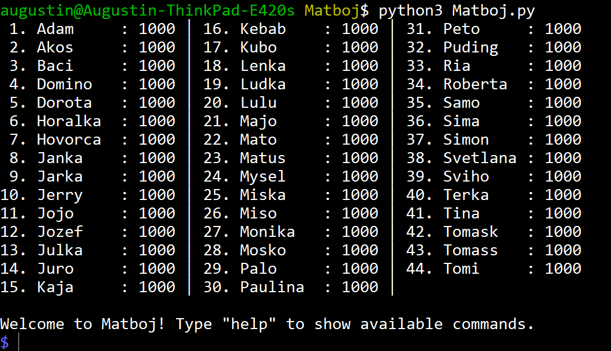

# Matboj evaluator

Used at math camps like [Pikomat](https://www.pikomat.sk/) or
[KMS](https://kms.sk/) for keeping score when all participants in the camp play
a board game and need to compute individual ranks periodically.

## See it in action



## Features

* Print the current scores or matches that have been played so far.
* Undo any match that has been played and recorded incorrectly.
* Save the game state in a JSON file and restore from it at any other time.
* Written as a command-line app which makes it extremely ergonomic to use. The
  user can handle 40+ people playing matches at the same time.
* No setup and dependencies needed, only a Python 3 installation.
* Short (~200 lines of code), so easy to hack and customize.
* Battle tested at a few events.
* Permissive MIT license.

## Using the evaluator

Put names of all the contestants in the `people.txt` file, one name per line.
All the names have to be unique and they are case-sensitive.

Then launch the application from the terminal:

```bash
python3 matboj.py
```

If you are using the app interactively, increase the text size in your terminal
and use an overhead projector to show the players what their scores are.
